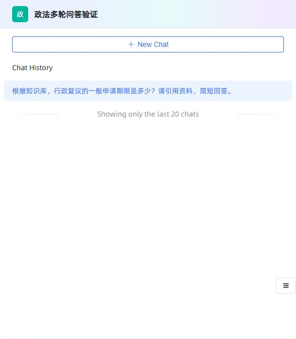

# 迭代检索与会话压缩验证

日期：2026-10-02。

## 实现范围

- 单次提问内执行检索、证据核验、针对缺口再次检索、最终流式回答。
- 最近问答与较早摘要同时用于问题改写和生成，压缩水位持久化，原始记录保留。
- 前端展示进度、每轮查询、资料缺口、停止原因及压缩统计。
- 函数库列表、分页、创建、读取、局部修改、软删除、调试、语法检查及执行接口。
- Python 只通过一次性 Docker 容器运行，提供 WSL Ubuntu 部署和隔离测试脚本。
- 局部修改应用配置时，未提供知识库 ID 列表就保留原关联。

## 测试与构建

Java clean package 成功，34 项测试全部通过：迭代检索 7 项、上下文 7 项、Gitee 辅助调用 3 项、Python 调度 8 项、文档解析 9 项。

Python 调度测试使用模拟容器进程验证生命周期，不代表真实容器隔离已验收。另用固定可信代码完成 4 项 runner 协议检查，涵盖参数、语法错误、辅助函数和异步函数；这不是宿主机执行用户代码的回退路径。

前端类型检查与生产构建通过，保留上游包体积等构建提示。

## 先前真实界面及接口验证（阈值策略调整前）

测试应用为“政法多轮问答验证”。

1. 一个问题同时询问行政复议期限及褚庙乡预算金额，触发三轮检索。依次新增 5、2、0 个片段。回答引用期限条文，并明确预算金额不能核实。
2. 临时保留一轮近期问答，触发自动压缩；追问最初的另一事项时，恢复出早期预算问题。
3. 辅助模型调用修正后，再次核实不可抗力影响申请期限，一轮检索判定资料充分，正确引用第二十条第二款。
4. Java 重启后摘要仍在；手动压缩生成修订号三，原始四条问答全部保留。
5. 继续追问“最初问的预算项目”，从摘要恢复具体项目，执行三轮检索，并明确无法核实正式名称及金额。界面显示已压缩三轮、保留近期一轮原文。
6. 测试应用历史保留设置已恢复为五轮；局部修改没有清空知识库关联。
7. 其他访客读取本会话摘要被拒绝；访客访问函数库返回 HTTP 403。
8. 函数库创建、分页、读取和局部更新成功；代码与参数保留。容器未就绪时执行接口明确拒绝，不在宿主机运行代码。


## Python 环境状态

WSL 官方安装包已验证微软签名并安装成功。Windows 可选组件启用遇到 `0x800f081f`（组件源缺失）。在线组件修复成功后仍未解决，提供的 ISO 已尝试作为组件源，仍返回相同错误；ISO 的组件版本落后于系统需要的累积更新。Ubuntu、Docker Engine 及真实容器执行仍需完成验收；未重启 Windows。

容器就绪后的命令：

```powershell
.\scripts\Setup-PythonSandbox.ps1 -Distribution Ubuntu
.\scripts\Test-PythonSandbox.ps1 -Distribution Ubuntu
```

任意原版工作流、函数导入导出、完整 Pylint 规则、联网函数及额外 Python 包仍需按各自范围验收。

## 2026-10-03 更新

- 自动和手动压缩仅在历史摘要与未压缩问答的估算 token 超预算时执行。低于或等于阈值不压缩，也不因轮数单独触发；真正压缩时才发送 compacting 事件。
- 模型生成改用 UniChatClient，移除业务层自建 HTTP 传输。客户端本地 HTTP 请求验证 2 项通过；Java 后端新增用户密码测试后共 38 项通过，前端生产构建通过。
- 两个普通账号已通过 API 验证：固定 USER 角色、登录、私有资源列表隔离、跨账号应用详情/删除/分享令牌与知识库详情/修改拒绝、管理接口拒绝、密码重置旧令牌失效、禁用后登录拒绝。
- 已有短会话主动压缩返回 compacted=false。
- 重启后数据库正常，应用服务已手动恢复。虚拟化固件启用，但 Windows 可选组件仍缺少源文件。按用户要求暂缓 Docker，不再继续系统修复。
- 前端补丁及逐文件校验清单见 customizations/2026-10-02；后续变化继续在该快照说明中记录。

当前界面补充验收：管理员“系统 → 用户”列表加载成功，“创建用户”对话框正常展示。API 已验证逻辑删除，全部 6 个临时验证账号已停用（其中一个已逻辑删除）。正式人员账号未代建。

通过统一客户端完成真实 UI 两轮问答：行政复议一般期限为六十日；追问不可抗力时正确引用同一资料第二十条。两次均一轮检索充分，短上下文未压缩。界面证明：




最终回归：使用自身知识库路径嵌入其他账号文档 ID，详情与段落列表均返回 HTTP 403；自身问题列表为空，非法问题批量删除被拒绝，自身应用分页仍正常。最终 clean package 38 项测试通过，服务已恢复运行。
