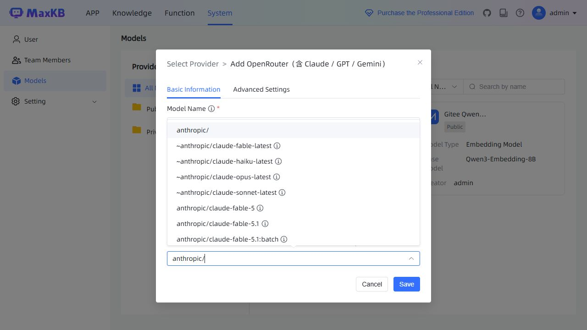
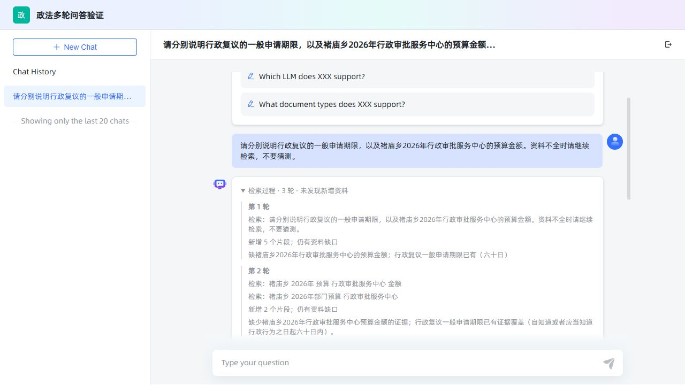
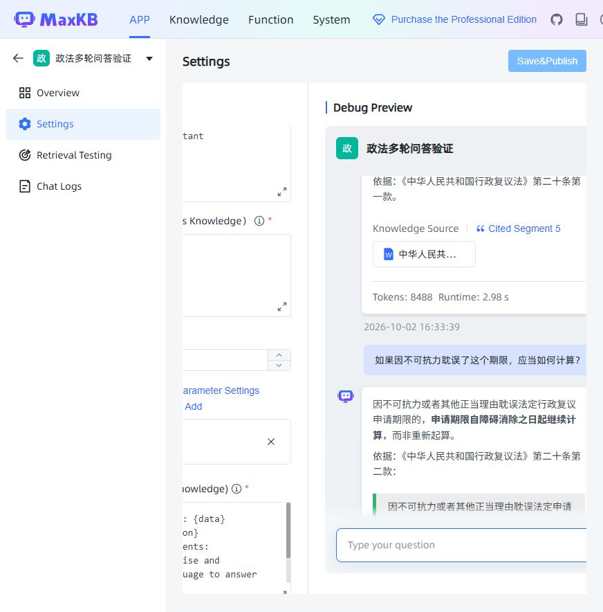
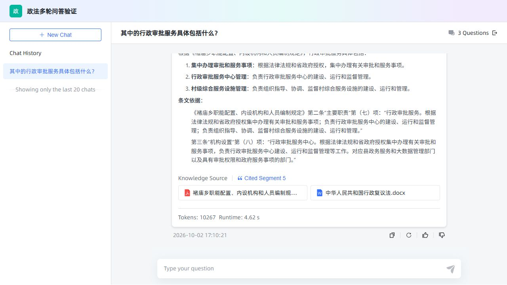
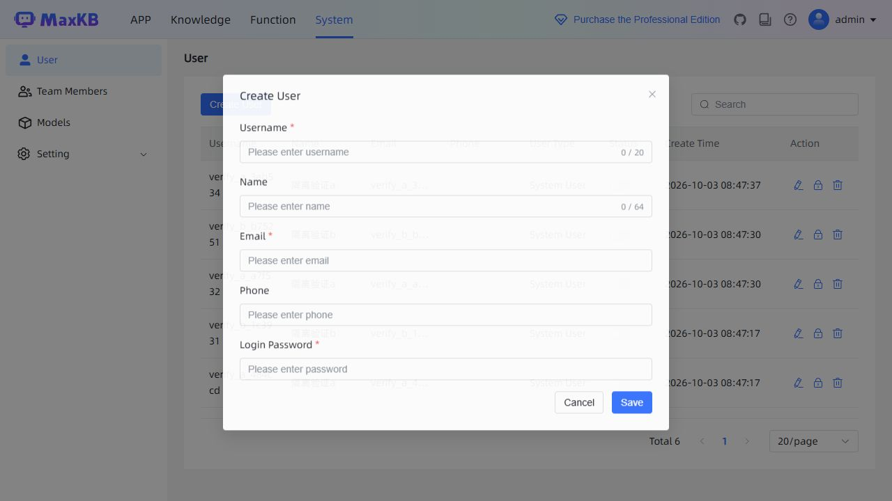
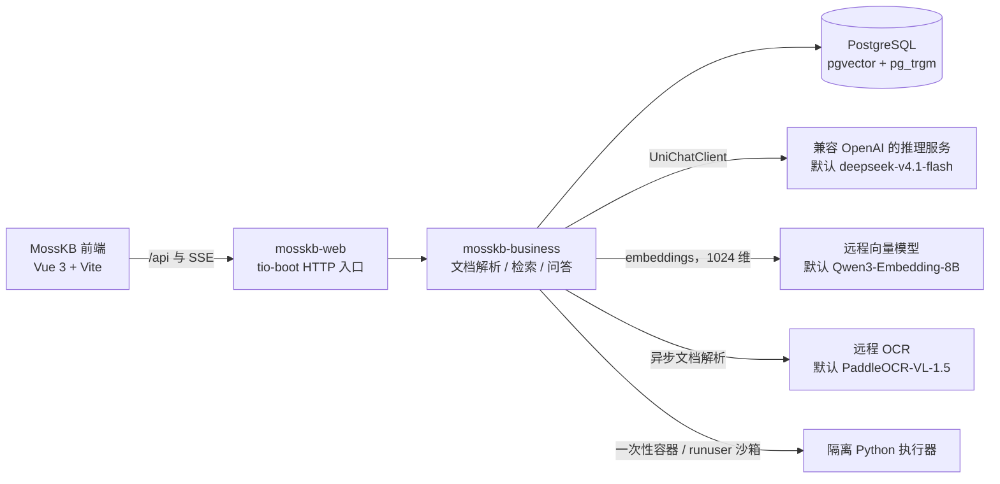
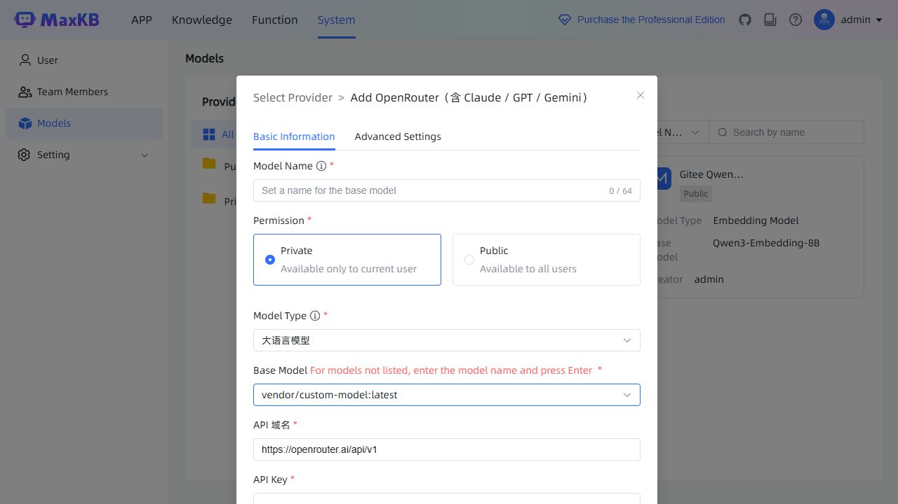

# Java MossKB

基于 tio-boot 的 Java 知识库后端，复用 MossKB 前端。通过文档检测、结构提取、远程 OCR、向量检索和多轮问答，把文档转成可追溯的知识库回答。模型生成复用 `java-openai` 的 `UniChatClient`，本机无需部署模型权重。

[前端仓库](https://github.com/litongjava/java-mosskb-ui) · [Java 后端仓库](https://github.com/litongjava/java-mosskb) · [开发文档](https://tio-boot.com/zh/knowledge-base/) · [演示视频](https://www.bilibili.com/video/BV1yJU8YHEgg/)

   

## 界面预览

<table>
<tr>
<td><br>
<b>模型管理与平台目录</b>：在「系统 → 模型」里按平台筛选，从目录中选模型，或直接输入完整模型 ID；右侧是默认的 Gitee 向量模型实例。</td>
<td><br>
<b>迭代检索过程</b>：一次提问内按“检索 → 判断资料是否充足 → 补充检索”执行多轮，逐轮列出检索词、新增片段数与仍然缺失的资料。</td>
</tr>
<tr>
<td><br>
<b>应用调试与多轮追问</b>：应用设置右侧直接预览，回答带引用片段、token 用量与耗时；追问沿用上文。</td>
<td><br>
<b>独立分享页</b>：刷新后恢复历史并继续追问，回答附知识来源与引用文档卡片。</td>
</tr>
<tr>
<td><br>
<b>上下文压缩</b>：只有历史超过 token 预算才压缩，界面显示已压缩轮数与保留的近期原文。</td>
<td><br>
<b>用户与资源隔离</b>：管理员创建普通账号，账号各自拥有应用、知识库与私有模型。</td>
</tr>
</table>

以上截图来自本机的真实联调记录，逐条验收过程见[验证记录](docs/agent-verification.md)与[本机验证记录](docs/local-verification.md)。

## 当前能力

- 用户、知识库、文档、分段、问题及应用管理；普通账号按所属资源隔离，支持公共模型和分享聊天。
- 文档先检测再解析：文字 PDF、本地结构化提取、扫描页和图片 OCR、混合 PDF 逐页处理，解析预览保留文件 ID。
- 上传后立即返回解析任务，解析在后台逐页推进，前端轮询进度后取分段；扫描页并发提取但正文仍按物理页顺序拼接，空白页不再让整份文档失败，偶发 OCR 失败按退避重试。
- 向量、关键词及混合检索；文档和查询使用知识库选定的同一个向量模型。
- 单次提问执行“检索 → 判断资料是否充足 → 补充检索 → 最终回答”，保留资料引用与检索过程。
- 读取当前会话最近问答及摘要；**只有 token 超过预算才压缩上下文**，超过对话轮数不会单独触发压缩。
- 平台目录、基础模型目录和表单入库；支持 OpenAI 兼容厂商与中转平台，允许手动输入模型 ID。
- 隔离 Python 执行器从不以 Java 进程身份运行用户代码：默认走一次性 Docker 容器（引擎可在本机，也可在局域网内已装 Docker 的主机），Linux 上也可用 `kb.python.runner=host` 切到沙箱用户后在独立目录里执行；两种 runner 不可用时都明确拒绝执行，不使用宿主机 Python 回退。

统计分析、Milvus 替代方案和完整官方工作流能力，不因前端有菜单或文档有设计示例就视为已全部实现。

## 架构与请求链路



后端只负责编排与存储：模型权重、OCR 与向量都在远程服务上，本机需要的是 JDK、PostgreSQL（含 pgvector 与 pg_trgm）和可选的一份 Docker 客户端。三类远程模型的名字、平台与配置键见[模型配置](#模型配置)。

## 目录与运行环境

推荐将两个仓库放在同一父目录：

```text
project-mosskb/
  java-mosskb/
    db/                   数据库结构与初始数据脚本
    mosskb-business/       业务逻辑与测试
    mosskb-web/            HTTP 入口和本地配置
    scripts/             初始化、启动、目录同步与补丁导出
    docs/                验证记录、定制说明和补丁
  java-mosskb-ui/
    src/                  前端源码（基于官方界面，保留必要定制）
```

需要 JDK 21、Maven、Node.js/npm、已启动的 PostgreSQL，以及安装在数据库服务端的 pgvector 和 pg_trgm。默认远程服务需要可用的 Gitee API Key。Docker 仅为隔离 Python 执行功能所需，且不必装在本机；Linux 上也可以用宿主的 `runuser` 沙箱替代 Docker。

## 配置与初始化

在 `mosskb-web/my.txt` 创建本地配置，每行一项：

```properties
jdbc.url=jdbc:postgresql://127.0.0.1:5432/<实际数据库名>
jdbc.user=<数据库用户>
jdbc.pswd=<数据库密码>
app.admin.secret.key=<本机生成的随机签名密钥>
server.port=10060
app.env=dev
jdbc.showSql=false
# 扫描版 PDF 动辄十几 MB，t-io 默认只收 2MB 的请求体，
# 不配这两项时上传会在解析请求头阶段直接断开连接。
http.multipart.max-request-size=110100480
http.multipart.max-file-size=104857600
```

`http.multipart.max-request-size` 必须和 `server.port`、数据库连接写在同一个本地配置文件里。放在打包的 `app.properties` 里不会被读取：只有第一份通过 `use` 载入的配置会成为主配置，本地文件是叠加在主配置之上的，因此部署相关的值都写在本文件。默认值分别对应 105 MB 请求体与 100 MB 单文件，比解析器自身的 100 MB 限制略大，超限时由业务层给出明确提示。

在 `mosskb-web/secrets.txt` 设置：

```properties
GITEE_API_KEY=<自己的密钥>
```

这两个文件、运行日志和测试令牌保持在 Git 忽略范围，不放入前端配置或补丁。

如果出现 `extension "vector" is not available`，需要先在实际运行 PostgreSQL 的机器上安装扩展文件，再连接业务数据库启用扩展；仅执行 SQL 不能安装缺失的二进制。Windows 与 Linux 的编译安装步骤见[部署章节](https://tio-boot.com/zh/knowledge-base/38)。

已有数据库不需要删除重建。在 Java 仓库根目录执行：

```powershell
.\scripts\Initialize-Database.ps1
```

Linux 使用同名 Shell 脚本：

```bash
./scripts/Initialize-Database.sh
```

两个脚本都读取 `my.txt`，依次执行 `db/schema.sql` 与 `db/seed.sql`：前者建立扩展、31 张业务表、索引与外键并补齐旧库缺少的列，后者写入管理员账号、默认模型、平台接入信息、平台模型目录快照与内置函数模板。两者都是幂等的，可以在已有数据库上重复执行。需要清空重建时加 `-Reset`（或 `--reset`），它会先执行 `db/reset.sql` 删除业务表。升级已有数据库前先备份。

### 隔离 Python 执行器

用户代码从不以 Java 进程的身份运行。执行器有两个 runner，由 `kb.python.runner` 选择，**默认 `docker`**（原行为不变）：

| runner | 适用 | 隔离方式 |
| --- | --- | --- |
| `docker` | Windows 与 Linux；引擎可在本机或局域网内其它主机 | 一次性容器：断网、只读根、非 root、内存/CPU/pids 上限、tmpfs |
| `host` | Linux（含容器内部署），不需要 Docker | `runuser` 切到沙箱用户 + 独立目录 + 白名单环境变量；**不断网、无只读根、无资源上限** |

配置项都在 `mosskb-web/my.txt`：

| 配置 | 作用 |
| --- | --- |
| `kb.python.runner` | `docker`（默认）或 `host` |
| `kb.python.docker` | docker 可执行文件路径，留空取 PATH 上的 `docker` |
| `kb.python.docker.host` | Docker 引擎地址，例如 `tcp://192.168.31.97:2375`；留空使用本机引擎 |
| `kb.python.wsl.distribution` | 使用 WSL 里的 Docker 引擎时填发行版名，与 `kb.python.docker` 二选一 |
| `kb.python.image` | 容器镜像，默认 `python:3.12-slim`；执行固定使用 `--pull=never`，需提前 pull 到目标引擎 |
| `kb.python.timeout_seconds` | 单次执行超时秒数，默认 15 |
| `kb.python.sandbox.user` | host runner 的沙箱用户，默认 `sandbox` |
| `kb.python.sandbox.dir` | host runner 的沙箱目录，默认 `/var/lib/java-mosskb/sandbox`，同时作为子进程的工作目录 |
| `kb.python.sandbox.python` | host runner 的 Python，默认 `python3` |
| `kb.python.sandbox.su` | 显式改用 `su` 提权（默认不配；见下面的说明） |

#### Docker runner

`kb.python.docker.host` 会作为 docker 的 `--host` 全局参数传给 `run` 和 `rm`，所以容器引擎不必装在本机；`DOCKER_HOST`、`DOCKER_CONTEXT`、`DOCKER_TLS_VERIFY`、`DOCKER_CERT_PATH` 也会透传给 docker 客户端。

本机没有 Docker 时，在运行 Docker 的主机上以 root 执行一次：

```bash
./scripts/enable-remote-docker-tcp.sh <本机客户端IP> 2375
```

脚本用 socat 容器把 unix socket 转发到 TCP，只用 iptables 放行指定来源，不重启 dockerd。明文 2375 没有认证，能连上它等于拿到该主机 root 权限，仅适合可信内网；有条件时应改用 2376 双向 TLS 或 `ssh://` 隧道。客户端侧只需要一个 docker 客户端：Windows 下载 `https://download.docker.com/win/static/stable/x86_64/docker-<版本>.zip`，解压出的 `docker.exe` 即可，不需要 Docker Desktop 和 dockerd。目标引擎上还要有镜像：

```powershell
docker --host tcp://192.168.31.97:2375 version
docker --host tcp://192.168.31.97:2375 pull python:3.12-slim
.\scripts\Test-PythonSandbox.ps1
```

`Test-PythonSandbox.ps1` 默认读取 `my.txt` 的实际配置（也可用参数临时覆盖），检查容器内 uid、只读根文件系统、无网络和密钥不可见。

#### host runner

在 Linux 主机（或容器）里以 root 执行一次：

```bash
./scripts/setup-python-host-sandbox.sh sandbox /var/lib/java-mosskb/sandbox python3
```

脚本创建沙箱用户与目录（0750），并用 `runuser` 验证确实切到了该用户。然后把上面的 `kb.python.runner=host` 四项写进 `my.txt`。

要求与限制，都要如实看待：

- java-mosskb 必须**以 root 运行**，否则 `runuser` 无法切换用户；执行前会校验并拒绝。
- 默认用 util-linux 的 **`runuser`**，不是 `su`。`/bin/su` 是 setuid 程序：实测由 JVM 启动它，默认的 posix_spawn 会在 `ProcessBuilder.start()` 卡死，改用 `-Djdk.lang.Process.launchMechanism=FORK` 也会返回 `su: Authentication failure`；同一台机上从 shell 调用 `su` 却正常。`runuser` 不带 setuid，argv 直接传递，由 JVM 启动没有问题。确有需要时可用 `kb.python.sandbox.su` 覆盖，但要自己确认在目标环境可用。
- 子进程只拿到白名单环境变量（`PATH`、`LANG`、`LC_*`、`TZ`、`TERM`）加上固定的 `HOME`/`TMPDIR`/`USER`/`LOGNAME`/`SHELL`，应用密钥不会进入用户代码；超时会连同子进程整棵树一起终止。
- **不提供**断网、只读根文件系统和内存/CPU/pids 上限，沙箱用户可以读宿主上其他人可读的任何文件。因此 `my.txt`、`secrets.txt` 等含密钥的文件应当 `chmod 600`。需要这些保证就继续用 `kb.python.runner=docker`——两者可以在同一份配置里按环境切换。

## 构建与启动

先在 `java-mosskb-ui` 目录安装前端依赖：

```powershell
npm install
```

然后在 Java 仓库根目录构建并启动：

```powershell
.\scripts\Start-Local.ps1 -Build
```

Linux 与 WSL 使用同名 Shell 脚本：

```bash
./scripts/Start-Local.sh --build
```

该脚本后台启动 Java 与 Vite；`-Build` 构建会跳过测试并跳过 GPG 签名。可用 `-JavaExecutable`、`-NodeExecutable`、`-MavenExecutable` 指定实际可执行文件路径（Shell 脚本用 `JAVA_BIN`、`NODE_BIN`、`MAVEN_BIN` 环境变量）。已有端口监听会被复用；修改代码后需停止确认属于本项目的旧进程，再重新构建启动。

- 前端：<http://localhost:3000/ui/>
- Java API：<http://localhost:10060/api>
- 后端日志：`mosskb-web/logs/startup.log`、`startup-error.log`
- 前端日志：`java-mosskb-ui/.local/vite.log`、`vite-error.log`

也可以分别执行：

```powershell
mvn clean '-DskipTests' '-Dmaven.javadoc.skip=true' '-Dgpg.skip=true' -Pproduction package
.\scripts\Start-Local.ps1
```

Java 运行工作目录为 `mosskb-web`，以便加载本地配置。实际可运行 JAR 位于 `mosskb-web/target`，不要使用旧 README 中不存在的根目录 JAR 路径。

## 创建用户与使用知识库

管理员登录后，在“系统 → 用户 → 创建用户”新增账号。普通账号登录后拥有自己的应用、知识库和私有模型；停用或密码重置会使旧令牌失效。管理员仍有管理权限；需要数据库和进程也完全独立时，应分别部署实例。

头像菜单的“语言”可以切换简体中文 / 繁体中文 / 英文，选择通过 `POST /api/user/language` 存进 `moss_kb_user.language`，再由 `GET /api/user` 下发给前端，下次登录仍然生效；`language` 为空（默认）表示跟随浏览器语言。老库升级时先执行 `db/schema.sql`，里面的 `ADD COLUMN IF NOT EXISTS` 会补上这一列，列缺失会让个人资料接口报错。

基本流程：创建模型 → 创建知识库并选择向量模型 → 上传文档并检查解析预览 → 确认分段 → 创建应用并关联知识库和聊天模型 → 在 UI 调试及追问。前端提交分段时必须保留解析返回的文件 `id`。

## 模型配置

平台信息存于 `moss_kb_model_provider`，候选模型存于 `moss_kb_model_catalog`，用户创建的实例与凭据存于 `moss_kb_model`。运行时不再读取固定供应商 JSON。



在“系统 → 模型 → 添加模型”选择平台，选择或手动输入完整模型 ID 后按回车，再填写 API 地址及 Key。保存校验使用实际填写的模型 ID；编辑时掩码 Key 保留原凭据，更换 API 地址必须重新填写新平台 Key。

预置 OpenAI、Gitee、OpenRouter、硅基流动、DeepSeek、百炼、Kimi、智谱、Gemini 兼容接口、火山方舟和自定义中转入口。Claude 可以通过兼容中转使用，不代表已接通全部厂商原生协议。不同平台需要各自的有效密钥。

默认 Gitee 配置：

| 用途 | 模型 | 平台与配置键 |
| --- | --- | --- |
| 最终回答默认模型、问题改写、证据核验和摘要 | `deepseek-v4.1-flash` | Gitee 兼容接口，`kb.chat.model` |
| 默认远程向量 | `Qwen3-Embedding-8B`，1024 维 | Gitee embeddings，`kb.embedding.model` |
| 扫描页与图片 OCR | `PaddleOCR-VL-1.5` | Gitee 异步文档解析接口 |

`deepseek-v4.1-flash` 属 DeepSeek Flash 系列，DeepSeek 官方平台把同系列模型 ID 写作 `deepseek-flash`，两者是不同平台的 ID，不要混填。

应用选择的模型用于最终回答；辅助步骤仍使用配置的 Gitee 模型。向量模型必须返回 1024 维，已有文档的知识库不能直接切换向量空间，需要新建知识库并重新导入文档。

目录快照包含获取时的平台模型，不代表永久可用或所有模型已实测。管理员可刷新 OpenRouter/Gitee 目录：

```powershell
python scripts/Sync-ModelCatalog.py --source openrouter --token-file <管理员令牌文件>
# Gitee 需先在当前进程环境中设置 GITEE_API_KEY
python scripts/Sync-ModelCatalog.py --source gitee --token-file <管理员令牌文件>
```

其他兼容平台可通过管理员接口 `POST /api/provider/catalog/discover` 发现 ID，再用 `PUT /api/provider/catalog` 明确类型并登记。同步不自动删除未返回项，停用项由管理员明确设置 `enabled:false`。目录维护不需要重新编译。

## 开发文档

设计、实现过程与逐章源码说明维护在 tio-boot 文档站的《Java MossKB 知识库》章节：

**<https://tio-boot.com/zh/knowledge-base/>**

| 章节 | 内容 |
| --- | --- |
| [01 数据库设计](https://tio-boot.com/zh/knowledge-base/01) | 31 张业务表的字段、索引与外键 |
| [03 模型管理](https://tio-boot.com/zh/knowledge-base/03) / [33 支持自定义模型](https://tio-boot.com/zh/knowledge-base/33) | 平台目录、模型实例、自定义模型 ID 与保存校验 |
| [17 VL 模型文档解析方案和费用对比](https://tio-boot.com/zh/knowledge-base/17) / [18 文档解析模型实测](https://tio-boot.com/zh/knowledge-base/18) / [19 文档解析优化](https://tio-boot.com/zh/knowledge-base/19) / [22 多文档解析](https://tio-boot.com/zh/knowledge-base/22) / [42 文档解析异步化](https://tio-boot.com/zh/knowledge-base/42) | 解析策略、OCR 模型横评、逐页处理与后台异步解析任务 |
| [25 创建独立用户与账号资源管理](https://tio-boot.com/zh/knowledge-base/25) | 独立用户与资源权限 |
| [31 多轮检索](https://tio-boot.com/zh/knowledge-base/31) / [32 上下文压缩](https://tio-boot.com/zh/knowledge-base/32) | 单次提问内的迭代检索、会话历史与 token 阈值压缩 |
| [34 爬取网页数据](https://tio-boot.com/zh/knowledge-base/34) / [39 离线运行向量模型](https://tio-boot.com/zh/knowledge-base/39) | 网页知识库、离线向量方案 |
| [35 隔离 Python 执行环境配置](https://tio-boot.com/zh/knowledge-base/35) / [36 隔离 Python 执行器](https://tio-boot.com/zh/knowledge-base/36) / [37 函数库与调用接口](https://tio-boot.com/zh/knowledge-base/37) | Docker over TCP / 宿主沙箱、执行器与函数库接口 |
| [38 Windows 与 Linux 部署](https://tio-boot.com/zh/knowledge-base/38) | 数据库初始化脚本、后端与前端构建启动 |
| [41 存储文件到云存储](https://tio-boot.com/zh/knowledge-base/41) | 尚未实现，仅记录设计 |

文档站提供 [llms.txt 与分章节语料](https://tio-boot.com/ai-retrieval.html)，可以直接交给 AI 工具检索。

## 验证

改代码或改数据库结构之后，先跑一遍回归测试：

```powershell
mvn test
```

当前结果：`mosskb-business` 88 项、`mosskb-web` 51 项，共 139 项，0 失败；其中 7 项因为缺少外部服务或私有数据自动跳过（JUnit `Assume`），跳过原因会打印在测试输出里。

`mosskb-web` 下的 `com.litongjava.mosskb.regression` 包专门盯住改名之后最容易回退的地方：

| 测试类 | 覆盖内容 |
| --- | --- |
| `BrandingRegressionTest` | 全仓库源码、配置、脚本与文档里不再出现旧品牌字样，只放行要求的用户手册链接 |
| `SchemaRegressionTest` | `MossKbTableNames` 登记的表在库里都存在、常量名与表名一致、没有旧品牌前缀的表、扩展已安装、表数量与 `db/schema.sql` 一致 |
| `SeedDataRegressionTest` | 管理员账号与文档记录的初始密码、默认推理与向量模型、平台接入、模型目录快照、内置函数模板 |
| `ApiContractRegressionTest` | `/api/display/info` 下发的标题、项目地址、论坛地址与手册链接，以及 `app.name` |
| `UserLanguageRegressionTest` | `POST /api/user/language` 能写库、`GET /api/user` 会带回 `language`、非法语言与未登录被拒绝且不改库 |
| `DocumentSplitTaskRegressionTest` | 分段预览任务的创建、进度、成功结果、失败原因与归属校验，并确认 `result` 是 `jsonb` |

部署完成后用冒烟脚本核对正在运行的服务：

```powershell
.\scripts\Test-Deployment.ps1 -PostgresBin 'D:\Program Files\PostgreSQL\18\bin'
```

它覆盖服务就绪、外观接口内容、未登录取 401、管理员登录、带令牌接口与数据库结构，当前 15 项全部通过。

2026-10-04 的构建与部署回归：`mvn test` 124 项通过（7 项跳过），`Test-Deployment.ps1` 15 项通过，Windows 本机实测记录见[部署章节](https://tio-boot.com/zh/knowledge-base/38)第六节。此后又完成一轮文档解析改造：整份解析改为后台任务加前端轮询，空白页不再作废整份文档，OCR 失败按退避重试；同一轮实测了两份真实政法政策 PDF（12 MB / 35 页扫描件与 227 KB / 8 页文字件），`mvn test` 139 项通过（7 项跳过），前端 `vue-tsc` 类型检查与 `vite build` 均通过，记录见[文档解析异步化](https://tio-boot.com/zh/knowledge-base/42)。此前另验证了真实 Gitee 创建/掩码编辑、跨平台密钥保护、UI 目录及手动 ID、知识库连续追问，以及局域网远程 Docker 引擎上的容器隔离执行和 Linux 宿主 `runuser` 沙箱执行；其他平台没有提供真实 Key，尚未进行全部平台的推理验收。前端构建在 `java-mosskb-ui` 执行 `npm run build`。两种 runner 的执行记录见[验证记录](docs/agent-verification.md)。

## 前端基线与定制恢复

前端以官方接口和代码为基线，Java 优先适配接口；独立路由、文件 ID、SSE 与 Agent 展示等必要定制单独保存。本次模型管理没有新增前端修改。

最新补丁与完整清单见 [2026-10-03 定制记录](docs/customizations/2026-10-03/README.md)，历史行为清单见 [2026-10-02 记录](docs/customizations/2026-10-02/README.md)。当前快照基准是已有 fork 的合并目标，不能将其称为已经核实的官方 upstream 提交；当前已有合并状态保留。

```powershell
# 默认只检查；正在合并的仓库需要先正常完成合并
.\scripts\Apply-FrontendCustomizations.ps1 -Repository ..\MossKB -Bundle .\docs\customizations\2026-10-03
```

通过检查后再用 `-Apply` 应用；锁文件补丁单独保存，升级时不要盲目覆盖。前端和后端导出脚本会在临时目录应用补丁并校验内容，不修改工作仓库索引。Java 新增或修改的 `if` 语句必须使用 `{}`，Maven 构建可加 `-Dgpg.skip=true` 跳过签名。

## Star 与在线体验

- **Star 本项目**：如果这个项目对你有帮助，欢迎在 [GitHub 仓库](https://github.com/litongjava/java-mosskb) 点一个 Star；前端仓库见 [java-mosskb-ui](https://github.com/litongjava/java-mosskb-ui)。Star 是最直接的支持，也能让更多需要私有化知识库的人找到它。
- **获取体验账号和密码**：在线体验环境使用受控账号，**不开放自助注册**。添加下面的微信（备注 **java-mosskb**）联系作者，说明用途即可获取体验账号和密码；也可以先在 [Issues](https://github.com/litongjava/java-mosskb/issues) 里提问。

## 交流学习

- 微信：**jdk131219**，添加时请备注 **java-mosskb**，拉你进交流群。
- 使用问题、缺陷与建议请提到 [Issues](https://github.com/litongjava/java-mosskb/issues)，方便其他人检索同样的答案。
- 文档站与仓库的改进建议都欢迎：提 [Issue](https://github.com/litongjava/java-mosskb/issues)，或加上面的微信直接交流。

## 商务合作

商务合作、定制开发与私有化部署请联系：**<https://bytemoss.cn/contact.html>**

## 许可证

Java 项目许可证以 [LICENSE](LICENSE) 为准（MIT）。前端及其他依赖遵循各自仓库的许可证。
